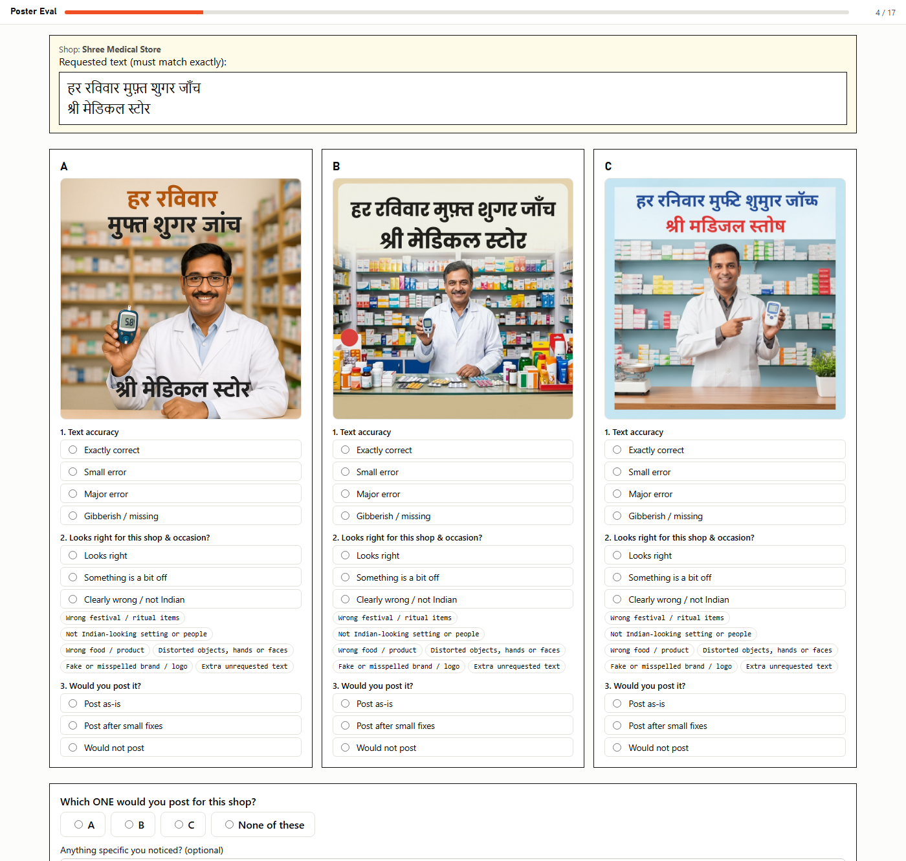
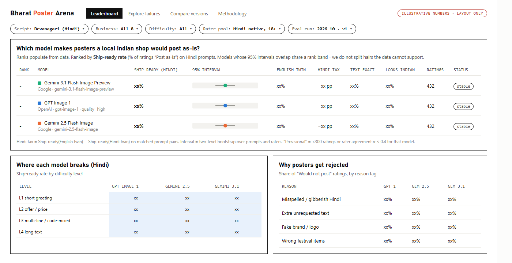
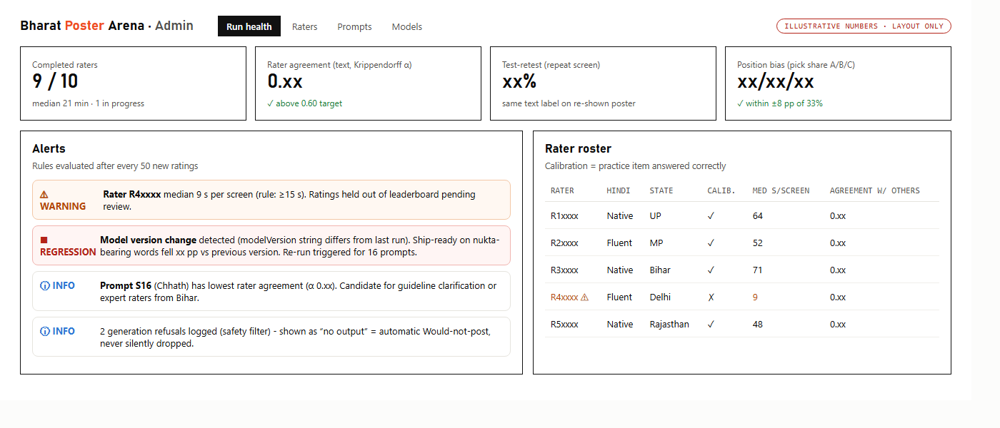
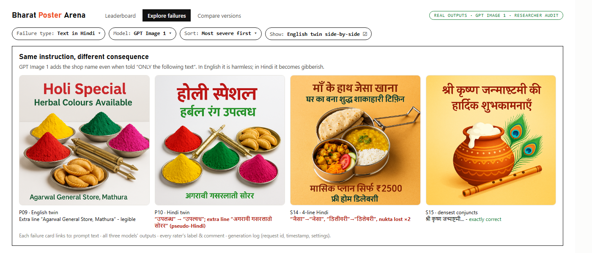
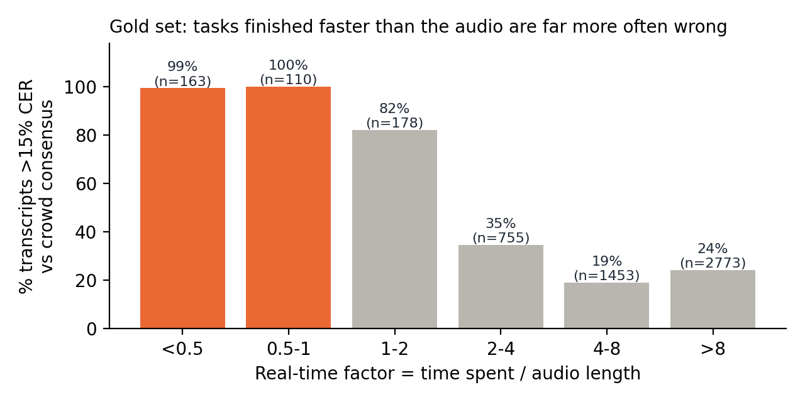
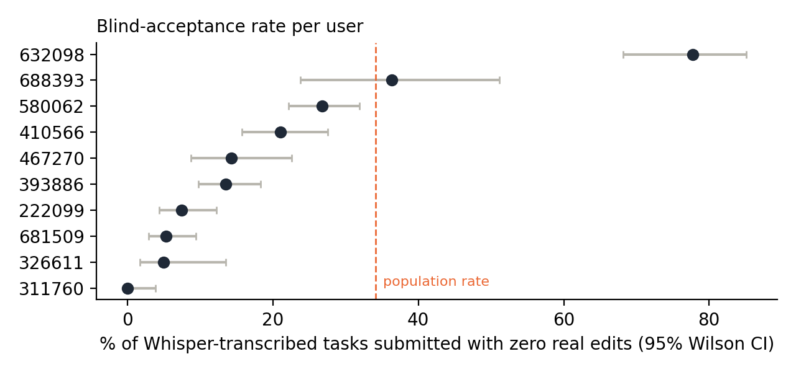

Product Task · July 2026 · Submission

# Does it spell Hindi right?

A focused evaluation of AI-generated posters for India's local shops, and a fair system for catching low-quality transcribers.

{{candidate_name}} · {{candidate_email}} · {{date}}

Inside this document

<a class="row" href="#onepager">One-page report</a><a class="row" href="#q1a">Q1 · The evaluation and why it matters</a><a class="row" href="#q1b">Q1 · How it works and how people judged</a><a class="row" href="#q1c">Q1 · Results and findings</a><a class="row" href="#q1d">Q1 · The eval as a product, and scale</a><a class="row" href="#q2">Q2 · Spotting low-quality transcribers</a><a class="row" href="#wrap">Reflection and video script</a><a class="row" href="#appendix">Appendix: prompts, images, logs, data</a>

In 30 seconds

Image models make beautiful posters. For a shop in Kanpur that wants its offer in Hindi, the question is simpler: **is the Hindi spelled right, and would the owner post it?** I tested this with matched English and Hindi versions of the same poster, so each model's "Hindi tax" can be measured directly.

Models

GPT Image 1Gemini 2.5 Flash ImageGemini 3.1 Flash Image Preview

Labels used

REAL DATAMY AUDITAI, NOT HUMAN

Video walkthrough

<a class="extlink" href="{{video_url}}">▶ {{video_url}}</a>

Code, images and data

<a class="extlink" href="{{materials_url}}">{{materials_url}}</a>

One-page report

# Hindi posters for local shops: how much worse do AI models get when the text is in Hindi?

The eval

**Category:** marketing for India's micro-businesses. **Use case:** a shop owner in a Hindi-speaking town asks an AI tool for a WhatsApp Status poster (festival greeting, discount, price, notice) with exact Hindi text.

Why it matters

India has 7.3 crore registered MSMEs, almost all micro, and WhatsApp is their shop window. Hindi is the first language of 52.8 crore people. One wrong matra makes a shop look careless, and a wrong word on a price or health notice misleads customers. Public image leaderboards rank overall taste on English prompts, so they can't see this failure.

Setup

16 prompts across 8 real business types. **6 matched pairs** use the identical prompt in English and Hindi, which isolates the **Hindi tax**. 4 stress tests cover mixed scripts, long copy, dense conjuncts and Chhath Puja. One image per prompt per model, first output kept.

Participants

{{n_participants}} Hindi-reading adults (18+, consented) rate all 48 posters blind, in random order, on a phone app I built: text accuracy, cultural fit, *"would you post it?"* and best of three. **Main metric: ship-ready rate**, the share rated "post as-is".

Key findings

{{onepager_findings}}

**Most important takeaway.** "Looks great" and "usable" split apart exactly where India is different: the script. Labs should track **ship-ready rate per script**, not overall image quality. Products should never trust an image model to spell Indic text unchecked: verify it with OCR, or typeset the text on top of a generated background.

**Q2 in one line.** Most of the `user_id` column turned out to be task IDs, so I validated signals against a hidden gold set (41 clips, ~126 transcribers each). Tasks submitted faster than the audio's own length were wrong **99.6%** of the time vs **26.5%** otherwise. My system combines independent signals with unannounced test clips, and never blocks anyone without a human listening to the audio.

Question 1 · Part A

# The evaluation and why it matters

What I tested, for whom, and why this was worth testing over nine other ideas.

## What I evaluated

The user

The owner of a small shop in a Hindi-speaking Tier-2 or Tier-3 town: a mithai shop in Kanpur, a kirana in Indore, a tailor in Jaipur. They market on WhatsApp Status and groups, can't afford a designer, and need a new poster for every festival and offer.

Their job to be done

*"Give me a poster I can post right now, in my customers' language, with my exact words and price."*

What breaks

Image models handle English text well but often produce Hindi that is almost right: a dropped nukta, a misplaced ि matra, a broken conjunct, or fake letters that only look like Devanagari. To someone who doesn't read Hindi, the poster looks perfect. To the shop's customers it looks careless.

What "better" means

A poster the owner would **post without edits**. In order: (1) exactly the requested text, (2) nothing unrequested or misleading, such as extra text or fake brands, (3) visuals that fit the shop and the occasion, (4) looks good.

## Why this eval, and not the others

I listed ten India-specific ideas and scored each 1 to 5 on the brief's criteria: India-specificity, business use, whether it exposes model differences, ease of prompting and judging, scale, originality, value to a lab and noise. The deciding question was: **can 8 to 10 ordinary raters judge it reliably, and does the answer drive a product decision?**

| Idea | Score /50 | Verdict |
|---|---|---|
| **Hindi-text posters for local shops** | **48** | **Chosen.** Very Indian, very common, and checkable: any Hindi reader can compare a spelling with the requested text |
| Health awareness posters in Indian languages | 41 | Same core skill, rarer use. Folded in as one pair (a chemist's free sugar test notice) |
| Food-delivery dish photos | 37 | Judging a regional dish depends on where the rater is from |
| Wedding invitation designs | 37 | Overlaps with posters, and is religiously sensitive |
| Ethnic-wear catalogue shots | 36 | Big market, but judging a saree drape needs experts, not 8 lay raters |
| Regional festival imagery | 33 | Subjective with no clear decision. Folded in as one Chhath Puja prompt |
| Hindi-labelled school diagrams | 33 | Errors are mostly generic (labels, science), not Indian |
| Indian faces and skin tones | 32 | Already well studied |
| Rural/urban stereotype audit | 31 | Important but noisy, and no clear product decision |
| Farming advisory illustrations | 29 | Needs agronomists to judge |

## Why it matters for India, and why an AI lab should care

- **The users are many.** India has **over 7.3 crore Udyam-registered enterprises**, nearly all micro ([MSME Year-End Review 2025](https://www.drishtiias.com/daily-updates/daily-news-analysis/year-end-review-2025-ministry-of-microsmall-and-medium-enterprises/print_manually)). India is **WhatsApp's largest market, with 500M+ users** ([TechCrunch](https://techcrunch.com/2024/07/31/mark-zuckerberg-says-india-is-the-largest-market-for-meta-ai-usage)).
- **The language is big and the script is hard.** Hindi is the first language of **52.8 crore people** ([Census 2011](https://factly.in/does-hindi-gain-from-the-exponential-population-growth-of-its-native-speakers/)), and Devanagari also serves Marathi, Nepali and Konkani. Vowel signs reorder (ि is written before the consonant it follows), consonants fuse into conjuncts (क्ष, ज्ञ, श्र), and small dots change meaning. A model can be excellent at English typography and still fail here.
- **Generic benchmarks miss it.** Arenas like the ones in the brief rank overall preference, mostly on English prompts, by voters who aren't checking Hindi spelling. A model can top them and still be unusable for this user.
- **The result drives a decision.** For a lab: is Indic text a weakness, and which words break (which tells you what training data to add)? For a product team building a "make my poster" feature: which model to use for Hindi, and **whether a text-checking layer is required before launch**.

Question 1 · Part B

# How the evaluation works

Prompt design, models, fairness rules, and how participants judged the outputs.

## The prompt set

Every prompt comes from **one fixed template**, so only the shop, the scene and the text change (all 16 are in Appendix A):

> Design a square promotional poster for WhatsApp Status for *{business}*. *{scene}*. The poster must contain ONLY the following text, *in English / in Hindi (Devanagari script)*, spelled exactly as given: Line 1: "..." Line 2: "..." Do not add any other words, letters, logos or watermarks. Style: bright, clean, professional design that a small local shop in India would proudly share with its customers.

6 matched pairs · the Hindi tax

Same prompt and scene, text in English **or** Hindi:

- Diwali greeting · mithai shop
- 10% off · kirana store
- ₹250 blouse stitching · tailor
- Admissions, 3 lines + phone · coaching centre
- Holi herbal colours · general store
- Free sugar test · chemist

4 stress tests

- **Mixed scripts:** English + Hindi on one poster (mobile shop)
- **Long text:** 4 lines, ~17 words (tiffin service)
- **Dense conjuncts:** श्री कृष्ण जन्माष्टमी (sweet shop)
- **Less-represented festival:** Chhath Puja (Patna fruit shop)

Difficulty climbs from a short greeting to long text. Real traps are spread throughout: nukta (सिर्फ़), chandrabindu (जाँच), conjuncts (क्ष, ज्ञ), ₹, digits and a phone number. Every line is something a real shop would write.

Using the same template, quoting the exact text and saying "ONLY this text" means differences come from the models, not from vague prompts. The English versions act as a control for prompt difficulty.

## Models and fairness

| Company | Model | Where generated | Settings | Status |
|---|---|---|---|---|
| OpenAI | GPT Image 1 (`gpt-image-1`) | OpenAI Image API | 1024×1024, quality high, 1 image | {{gen_status_gpt1}} |
| Google | Gemini 2.5 Flash Image (`gemini-2.5-flash-image`) | {{platform_g25}} | 1:1, default 1K | {{gen_status_g25}} |
| Google | Gemini 3.1 Flash Image Preview (`gemini-3.1-flash-image-preview`) | {{platform_g31}} | 1:1, default 1K | {{gen_status_g31}} |

**Fairness rules:** identical prompt text and square format for every model. **One image per prompt per model, and the first output is kept** (the script won't overwrite, so there is no cherry-picking). Refusals count as "would not post". Every image is logged with its timestamp and settings (Appendix D). GPT Image 1 has a quality setting (I used high, as a shop owner would); the Gemini models don't, so they use their default. I didn't add a fourth model, because it would add a third more rating work without changing the decision.

## How participants judged

The rating app (real, working). The requested text is pinned at the top; three blinded posters sit side by side; three questions per poster, then "which one would you post?".

The questions

1. **Text accuracy:** exactly correct · small error (1 or 2 letters off, still readable) · major error (wrong, missing or extra words) · gibberish or missing
2. **Looks right for this shop and occasion?** yes · a bit off · clearly wrong, plus tags such as *fake brand* or *extra text*
3. **Would you post it?** as-is · after small fixes · no
4. **Which one would you post?** A · B · C · none

Why this method

With only 8 to 10 people, every minute of rating must count. Pure A/B voting gives one bit per vote and hides *why* a model lost. Rating each poster against the exact text is close to objective. Seeing all three side by side keeps judgments consistent, and the final pick gives preference data as well.

| Risk | What I did about it |
|---|---|
| Knowing the model biases the rating | Images carry random IDs; the key never ships in the app |
| Position or order effects | Poster positions and prompt order are shuffled for each person |
| Misunderstanding the scale | A practice poster with one wrong matra, with feedback |
| Careless or inconsistent rating | One screen is repeated at the end; people who average under 15 s per screen are excluded |
| Rating looks, not text | The text question comes first; the reference text is pinned; tap to zoom |
| Eligibility | 18+ gate, consent checkbox, "can you read Hindi?" check |

**Design in numbers:** 16 prompts × 3 models = 48 posters. Every participant rates every poster (16 screens + 1 repeat, about 20 minutes). At 9 people that would be 432 poster ratings. **This run: 2 verified participants, 102 poster ratings (including the repeat screen) and 34 best-of-three picks.**

**What this sample can and can't prove.** Ratings of the same poster aren't independent, so the real sample size is **16 prompts**, not 432 ratings. I use intervals that resample both prompts and raters. With 16 prompts, only gaps of **about 25 percentage points or more** count as a real direction; smaller gaps are reported as description. Agreement between raters is measured with Krippendorff's alpha. I planned this analysis before seeing any ratings, and I deliberately avoid significance tests on single prompts.

Question 1 · Part C

# Results and findings

What I can show today, clearly labelled by where it comes from.

## Results

### My letter-by-letter audit of the outputs MY AUDIT

Before the study, I read every poster against the requested text. This is my own inspection of real outputs, not participant data; it will be compared with the participants' labels.

{{audit_summary}}

Per-image notes are in Appendix C.

{{ai_panel_block}}

### Participant study (humans)

{{q1_results_block}}

## Findings

{{findings_block}}

## What an AI lab or product team should do

1. **Measure per script, ship per script.** One overall quality score hides the Hindi tax. Set a launch bar such as "80% ship-ready in Hindi" before a poster feature goes live in Hindi.
2. **Don't let the image model own the text.** Generate a background without text, then typeset the exact words with a proper Indic font engine. If the model keeps rendering text, read it back with OCR, compare it with the request, and retry or fall back on a mismatch.
3. **Route by script.** If one model wins on Hindi text and another on visuals, send Hindi requests to the first.
4. **Add guardrails that matter here:** strip text nobody asked for, block brand logos in business templates, and take extra care with price and health notices.
5. **Fix the data, not just the model.** Errors cluster in less common words, English loanwords written in Devanagari, and nukta. A targeted training set of shop names, prices and loanwords is cheaper than more general data.

Question 1 · Part D

# The eval as a product, and how it scales

The smallest product that is useful: a rating app, an honest leaderboard and a failure explorer.

| Who | What they do | Screen |
|---|---|---|
| Rater (Hindi reader, 18+) | Opens a link, consents, practises, rates 17 screens | Rating app (built, shown above) |
| Eval team at Josh Talks | Launches a run, watches quality, handles alerts | Admin dashboard |
| Model or product team | "Which model for Hindi posters?" then digs into failures | Leaderboard, failure explorer |

### Leaderboard

Ranked by **ship-ready rate in Hindi**, with 95% intervals. **Models whose intervals overlap share a rank**, because the data can't separate them. The English score and the Hindi tax sit alongside, so the gap is visible. A model is marked *provisional* until it has 300+ ratings. Filters: script, business type, difficulty, rater state, eval run.

Leaderboard with the real ratings from the 2 participants. Gemini 3.1 and GPT Image 1 share rank 1–2 because their intervals overlap; every model is provisional (well under 300 ratings).

### Admin dashboard and failure explorer

The admin view tracks completion, rater agreement, repeat-screen consistency and position bias. Alerts fire for raters who rush, for low-agreement prompts, and **when a provider's model version changes** (which re-runs the frozen prompt set). The failure explorer is where teams learn the most: filter by failure type, see the English twin next to the Hindi one, and open every rater's comment.

Admin dashboard for this run, real data: 2 raters, agreement, consistency, a position-bias warning, and the 2 rating files the integrity check rejected.

Failure explorer, real outputs: the same chemist notice from all three models, plus a broken greeting both raters called a "small error". Lay raters miss Devanagari errors that a letter-by-letter check catches.

### Scaling plan

| Stage | Raters | What grows | Quality control | Automation |
|---|---|---|---|---|
| **Pilot (now)** | 2 (target 8 to 10) | 16 prompts, Hindi, 3 models | practice item, repeat screen, rater agreement | none |
| **Next** | ~50 | 60 prompts, 2 images per prompt (separates the model from luck), add Marathi | hidden test posters with known errors; drop raters below 80% on them | OCR pre-checks text; humans confirm |
| **Then** | ~500 | 8 to 10 scripts (Bengali, Tamil, Telugu, Gujarati, Gurmukhi, Urdu...), more business types, new models monthly | per-script agreement targets, adjudication, state and gender balance | extra raters only where OCR is unsure or raters disagree |
| **Platform** | thousands | live leaderboard, private evals for labs | rater reputation, drift checks, fixed anchor prompts in every run | automatic re-run when a model version changes |

**Where raters come from:** Josh Talks already has 20,000+ daily transcribers who read Indian languages. Q1's rating platform and Q2's quality system are the same machine: people whose work is trusted *because* it is measured.

**What stays human:** "would I post this?", cultural fit and anything sensitive. **What can be automated:** exact text checking with OCR and string matching, extra-text and logo detection. One caution: a vision-LLM judge tends to read a misspelled word as the word it should be, so any automated judge must be checked against human labels before it is trusted.

Question 2

# Spotting low-quality transcribers

Part I finds the warning signs in the data. Part II turns them into a system that is fair enough to block accounts.

## How the work happens, and where it can be gamed

Audio → Whisper draft → worker listens → worker edits → submit → paid per accurate hour.

| Shortcut | What it looks like in the data |
|---|---|
| Not listening | submitted faster than the audio plays |
| Accepting the Whisper draft blindly | user text = Whisper text, even when Whisper is wrong |
| Cosmetic edits to look busy | only spaces or punctuation change |
| Placeholders | `[blank]`, ".", ",,,,," on clips that have speech |
| Accepting Whisper's made-up text | known fake strings like "प्रस्तुति प्रस्तुति" submitted as-is |

## What the data really contains REAL DATA

Before setting thresholds I checked the file (51,783 rows). Four findings changed the answer:

10

of 48,875 user_ids are real people. The rest are task IDs

99.4%

of rows: "chars per second" divides by audio length, not time taken

4 to 12 s

the 10 users' times: whole numbers, unrelated to clip length

41 × 126

hidden gold set: clips × median transcribers each

- **Only 10 IDs repeat** (86 to 609 tasks each). The other 48,865 appear once, and consecutive IDs share a recording folder 83% of the time, so they are task IDs. Per-person analysis is only possible for 10 users.
- **`segment_character_per_second` is mislabelled.** It equals characters ÷ *audio duration* (99.4% of rows), not ÷ time taken (0.07%). It measures how dense the transcript is, not how fast the worker typed.
- **The 10 users' timings look generated.** Always whole numbers, spread evenly from 4 to 12 s, with no link to clip length (correlation −0.01, vs 0.54 for everyone else). I make no time-based judgment about these users.
- **`is_edited` is inflated.** 83% say "Yes", but 23,104 of those rows have no Whisper text at all, and 963 differ only in spacing or punctuation.
- **A hidden gold set:** 41 test clips, each transcribed independently by a median of 126 people. I used the most central transcription as the reference answer and marked any task with over 15% character error as bad. That let me **test** which signals predict bad work instead of guessing.

## Part I · Warning signs

<h3>Warning sign 1 · Listening less than the audio</h3>STRONGEST

| | |
|---|---|
| What it tells us | You can't transcribe a 10-second clip you didn't hear. The minimum honest time is one full listen. |
| How to measure | **Speed ratio = time taken ÷ audio duration**, per task, on clips of 2 s or more. Per user: share of the last 100 such tasks below 1. |
| Evidence | In the gold set, tasks below 1 were **bad 99.6% of the time** (273 tasks) vs **26.5%** for the rest. 1 to 2: 82% bad; 2 to 4: 35%; 4+: about 20%. It also catches workers who *do* edit: edited tasks at 1 to 2 were still 70% bad. In normal production work, **18.7% of tasks were submitted faster than the audio**, vs 4.9% on test clips. People listen when it might be a test. |
| Red flags | Below **0.5** is impossible even at 2× playback. Between 0.5 and 1 is only possible at fast playback. A user with 30%+ of tasks below 1 gets more QA; 20%+ below 0.5 can lead to restriction. Minimum 30 tasks first. |
| False alarms | Experts using 1.5 to 2× playback; clear audio where Whisper is already right; timer bugs on low-end phones or poor networks; very short clips. Fix: log playback speed and actual audio played, ignore clips under 2 s, act only on patterns across many tasks. |

<h3>Warning sign 2 · Accepting Whisper without checking</h3>STRONG

| | |
|---|---|
| What it tells us | The job is to *fix* Whisper. Submitting its draft unchanged when Whisper is wrong means the worker didn't really listen. |
| How to measure | Normalise both texts (Unicode form, remove punctuation and extra spaces, so cosmetic edits don't count), then check whether they are equal. Per user: unedited share on clips of 5 s or more, with a 95% interval. **Better: hidden test tasks**, real clips whose Whisper draft has a known, verified error, mixed in at about 1 in 25. |
| Evidence | Whisper was wrong on every gold clip, yet 8.6% of submissions accepted it untouched. Across production, the unedited rate is 34%. **User 632098 left Whisper untouched on 78% of tasks (68 to 85%)**, 84% on longer clips, including obvious errors such as "लाओं से ... सहर में" for "गाँव से ... शहर में". |
| Red flags | Lower end of the user's interval above 60% (30+ tasks) → more QA. Hidden tests: 3 of the last 10 accepted → restrict; 5 of 10 → human review. A careful worker who misses 10% of planted errors hits 5 of 10 only **0.16%** of the time. |
| False alarms | Whisper genuinely right on clear speech; very short clips; a worker only on easy audio. Fix: measure on longer clips, compare with peers on the same language and audio quality, and rely on hidden tests for anything serious. |

### More signals (use together, never alone)

| Signal | Evidence | Use |
|---|---|---|
| **Accepting Whisper's made-up text.** Whisper repeats fake strings on near-silent clips | "प्रस्तुति प्रस्तुति" appears on 398 clips: 62% of people wrote `[blank]`, 17% submitted it as-is. User 580062 accepted 4 of 12 | 3+ acceptances and 50%+ of encounters → more QA |
| **Missing content.** Text much shorter than expected | Under half the reference length: all 205 such gold tasks were bad | More QA, stronger with signal 1 |
| **Placeholder on speech.** `[blank]` where Whisper heard real words | All 11 gold cases were bad | Nudge, then QA if repeated |
| **Junk entries.** Only punctuation, links, wrong script | User 393886 typed "." on 39 near-silent clips | **Block in the app with a helpful message.** A guideline problem, not fraud |

**Weak signals I would not use alone:** the `is_edited` flag (inflated); raw time taken (depends on clip length); characters per second (fast speakers and tags on tiny clips give extreme values); overall blank rate (19% of clips really are silent); very long times (idle tabs); repeated sounds like "ह ह ह" (real laughter; my first junk rule flagged these, so I removed it).

### The 10 users today

Text signals only, since their timings can't be trusted:

| User | Tasks | Untouched Whisper (95% CI) | Other evidence | Action |
|---|---|---|---|---|
| **632098** | 165 | **78% (68 to 85%)** | 84% on longer clips; obvious errors left in | **Human review of 20 recent long clips against the audio**; payouts wait for QA. Not an automatic block |
| 688393 | 86 | 36% (24 to 51%) | 48% on longer clips; small sample | 3× more QA |
| 580062 | 609 | 27% (22 to 32%) | accepted 4 of 12 fake strings; 21 punctuation-only entries | More QA and a guideline nudge |
| 410566 | 349 | 21% (16 to 28%) | 2 of 5 fake strings accepted | Nudge |
| Other 6 | 149 to 509 | 0 to 14% | nothing serious | No action |

## Part II · The detection system

**Principle:** behaviour (speed, edit patterns) only decides *where to look*. Serious actions need proof of **wrong output**: hidden test tasks, or QA on the real audio. No single metric ever blocks anyone.

| Level | Trigger (over a rolling window, minimum evidence) | Action | Way back |
|---|---|---|---|
| **0 · Prevent** | always on | App rejects punctuation-only or wrong-script submissions, requires the audio to be played, offers one `[blank]` button | n/a |
| **1 · Nudge** | one signal at a soft level, 30+ tasks | In-app tip: "6 long clips were submitted faster than their audio. Please listen fully." No pay impact | clears after 7 clean days |
| **2 · Look closer** | one strong signal, or two soft ones, 50+ tasks | QA on 15% of tasks; payouts for those wait for QA | QA error ≤ 5% over 20 audits |
| **3 · Restrict** | **two independent signals** strong, or QA error above 10% | Easier tasks only, daily cap, all work QA'd, clear notice | 2 weeks at QA error ≤ 5% |
| **4 · Human review** | level 3 for 14 days, 5 of 10 hidden tests failed, or clear fraud (shared device, scripted timing) | A trained reviewer listens to 20+ recent tasks; the worker can explain | reviewer decision |
| **5 · Block** | **all of:** reviewer confirms error far above target on real audio, two or more independent signals, and a prior warning with 7 days to improve (waived only for proven fraud) | Block, pay for verified good work, **appeal within 14 days to a different reviewer** | appeal |

**The rule in the brief's format.** If a transcriber **(X)** keeps submitting faster than the audio could be heard, **and/or (Y)** leaves known Whisper errors uncorrected on hidden tests, **and/or (Z)** submits blanks or junk on clips with speech, then raise QA and restrict. **Block only when** at least two of X, Y and Z hold, **and** a reviewer confirms from the audio that their error rate is far above target, **and** they were warned and given time to improve.

### If I were a bad transcriber, how would I game this?

| Trick | Counter |
|---|---|
| Leave the tab open to pad the time | Measure seconds of audio actually played, plus tab focus, not wall-clock time |
| Play the audio muted | Hidden tests: you can't fix an error you didn't hear |
| Add a space or full stop to look "edited" | Compare normalised text, where cosmetic edits don't count |
| Make random small edits | Hidden tests and QA measure correctness, not activity |
| Learn which tasks are tests | Tests use real production clips, look identical and rotate |
| Mark hard clips `[blank]` | Blank-on-speech signal; QA before paying for blanks |
| Stay just under the thresholds | Thresholds aren't published; independent signals; random QA for everyone |

### What engineering needs to build

| Metric | Data needed | Window | Threshold → action | Monitor |
|---|---|---|---|---|
| Audio coverage and speed ratio | play/pause/seek events, playback speed, focus, open and submit time | last 100 tasks ≥ 2 s, min 30 | below 0.5 on 20%+ → level 3 candidate; below 1 on 30%+ → level 2 | spread by language and device |
| Hidden test acceptance | test ID, planted error, submitted text | last 10 tests | 3 of 10 → level 3; 5 of 10 → level 4 | careful workers must pass 90%+ |
| Untouched Whisper rate | Whisper text and version, user text | last 100 clips ≥ 5 s | interval lower end > 60% → level 2 | baseline per language and Whisper version |
| Made-up text accepted | weekly auto-mined list of fake strings | 90 days | 3+ and 50%+ → level 2 | list growth |
| QA error rate (the ground truth) | reviewer's corrected text | 20+ audits | > 10% → level 3; confirmed in review → level 5 eligible | reviewer agreement on a 5% overlap |

**Also needed:**

- **Fix the data first:** a real `user_id` on every task, a correct definition for the characters-per-second field, a look at why one group's times are whole numbers from 4 to 12, and playback speed logging.
- **Guardrails:** no action under 30 tasks; at most one level change per week; compare workers with peers on the same language, clip length and audio quality; re-baseline for 7 days whenever Whisper is upgraded.
- **Fairness:** workers see *what* was flagged and how to fix it (never the exact thresholds); every block has a named reviewer, an evidence bundle and an appeal.
- **Watch for false positives:** if more than 10% of appeals are overturned, blocking pauses automatically.

**Rollout:** (1) weeks 0 to 2: add logging, input checks and hidden tests, no enforcement. (2) Weeks 2 to 6: shadow mode, where signals are computed and QA confirms whether flagged workers really are worse, and thresholds are tuned so no more than 2% of workers reach level 2. (3) Weeks 6 to 10: nudges and extra QA only. (4) Then restrictions and review in one language first; blocking only once appeals are staffed. **Success:** lower error in accepted data, lower cost per accurate hour, an overturn rate under 10%, and **good workers staying**.

Wrap-up

# Final reflection

Short answers to the brief's five questions, and the script for the video walkthrough.

**1. Why did you choose this eval?** It is the narrowest idea I found that still answers a real product question. Hindi posters for local shops are common, commercially real and very Indian. With only 8 to 10 raters, they are also judgeable with little noise, since anyone who reads Hindi can check a spelling. The matched pairs turn "is it good for India?" into one number: the Hindi tax.

**2. Why is it useful for India?** Crores of small businesses sell on WhatsApp in their customers' language and can't afford designers. A tool that makes a beautiful poster with one wrong matra fails them without them noticing. This eval measures the thing that decides whether such a tool is usable here, and it extends to every Indian script.

**3. Why would an AI lab building for India care?** Global leaderboards can't see this failure, and neither can evaluators who don't read Hindi. The eval gives a per-script launch decision, a list of failure types that points to the training data needed, and a check to re-run on every new model version.

**4. What did you learn from running the sample?** {{reflection_learned}}

**5. What would you improve with more time?** First, finish the human study: 2 raters show direction, 8 to 10 would give a ranking. Then two images per prompt per model and about 60 prompts; raters balanced across Hindi-speaking states; a second Devanagari language (Marathi) and one other script (Tamil or Bengali); checking an OCR text scorer against human labels so people only judge what machines can't; and testing "background + typeset text" as a fourth option to measure the product fix directly. For Q2: run shadow mode on real platform logs with proper user IDs and playback events.

## Video walkthrough script (under 2 minutes)

**0:00 to 0:15 · Problem.** "Picture a sweet-shop owner in Kanpur. Diwali's coming, so she asks an AI for a WhatsApp poster in Hindi. It looks gorgeous, but her shop's name is misspelled, and she can't tell. That's what I evaluated."

**0:15 to 0:40 · What.** "One narrow use case: Hindi posters for local Indian shops. I compared GPT Image 1, Gemini 2.5 Flash Image and Gemini 3.1 Flash Image Preview on 16 real posters: a kirana discount, a tailor's price, a coaching notice, a Chhath greeting. Six of them are twins: same prompt, only the language changes. So I can measure each model's Hindi tax directly."

**0:40 to 1:10 · How.** "{{n_participants}} Hindi readers rated all 48 posters blind in an app I built, with names hidden and positions shuffled. For each poster: is the text exactly right, does it look right for an Indian shop, and would you actually post it? That last one, the ship-ready rate, is my main metric."

**1:10 to 1:45 · Findings.** "{{video_findings}}"

**1:45 to 2:00 · So what.** "For labs building for India: measure ship-ready rate per script, not image quality. For products: never trust an image model to spell Indian scripts unchecked. Check it with OCR, or typeset it. And Q2 is in the doc: a fair way to catch bad transcribers. Thanks!"

Appendix

# Supporting material

Prompts, rating questions and consent, generation log, every generated image, and the Q2 tables. Code and full-size files: <a href="{{materials_url}}">{{materials_url}}</a>

## A · All prompts

{{prompt_table}}

## B · Participant instructions and consent

> **Instructions shown to participants:** Imagine you own a small shop in a Hindi-speaking town. You asked an AI tool to make a poster for your WhatsApp Status. On each screen you will see the exact text the shop owner asked for and three posters (A, B, C) from different AI models. The names are hidden and the order is shuffled. For each poster answer three quick questions, then pick the one you would post, or "None". Tap any image to zoom and check the text carefully.

**Practice item:** a mock poster reading "शुभ दीपावलि" against the requested "शुभ दीपावली". Correct answer: *small error* (short ि instead of long ी), with an explanation shown.

**Consent** (exact statement from the brief, a required checkbox): *"I confirm that I am 18 years or older. I voluntarily participated in this evaluation. I consent to my name, email, and responses/ratings being included in this assignment submission for hiring evaluation purposes."* The app stores the consent text and a timestamp with every rating; under-18s or no consent cannot continue.

{{participant_table}}

## C · My audit notes per image

{{audit_table}}

## D · Generation log

{{genlog_table}}

## E · All generated images

{{gallery}}

## F · Q2 supporting tables

{{q2_tables}}

Reproducible: <code>q1/generate.py</code>, <code>q1/build_rating_app.py</code>, <code>q1/analyze.py</code>, <code>q2/q2_analysis.py</code>, <code>tools/build_submission.py</code>.

